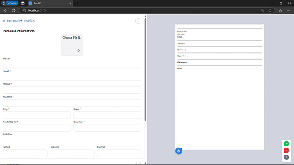

# **DanCV – Professional Resume Builder**  

🚀 **Create stunning, ATS-friendly resumes in minutes!**  

DanCV is an intuitive and powerful resume builder designed to help job seekers craft professional resumes with ease. Whether you're a student, a seasoned professional, or changing careers, DanCV provides customizable templates and smart tools to make your resume stand out.  

## **Features**  

✅ **Modern Templates** – Choose from multiple ATS-optimized designs.  
✅ **Easy-to-Use Editor** – Fill in your details with a structured form.  
✅ **Real-Time Preview** – See changes instantly as you edit.  
✅ **Multiple Export Formats** – Download as **PDF**.
✅ **Custom Sections** – Add skills, projects, certifications, and more.  
✅ **Mobile-Friendly** – Works seamlessly on desktop and mobile.  

## **How to Use**  

1. **Select a Template** – Pick a design that fits your style.  
2. **Fill in Your Details** – Enter your work experience, education, skills, etc.  
3. **Customize & Preview** – Adjust formatting and see live updates.  
4. **Download or Share** – Export your resume in PDF, DOCX, or generate a shareable link.  

## **Installation**  

### **Web Version**  

Access DanCV directly at: [https://dancv.vercel.app/](https://dancv.vercel.app/)  

### **Local Development** (For Contributors)  
```bash
git clone https://github.com/Danny-Quezada/DANCV.git
cd dancv
npm install
npm run dev
```  

## **Tech Stack**  
- **Frontend**: React.js, Tailwind CSS 
- **PDF Generation**: react-to-print


---  


👨‍💻 **Developer**: [Danny Quezada](https://github.com/Danny-Quezada)


---

## Demo Video



---


Craft the perfect resume and land your dream job with **DanCV!** 🚀